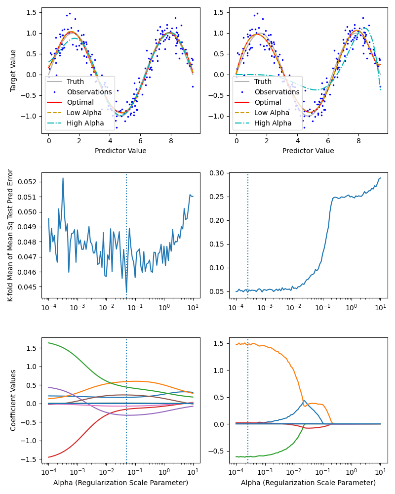

Machine Learning Practice Exercises in Python
=============================================

Objective
---------

Using scikit-learn, illustrate how to use basic concepts and algorithms in machine learning.

List of Exercises
-----------------

1. `ridge_vs_lasso.py <ridge_vs_lasso.py>`_: Fit a high order polynomial to sin function data, using ridge and lasso regulariztion to control the magnitude of the polynomial coefficients.

Gallery
-------

Ridge vs. Lasso
^^^^^^^^^^^^^^^

