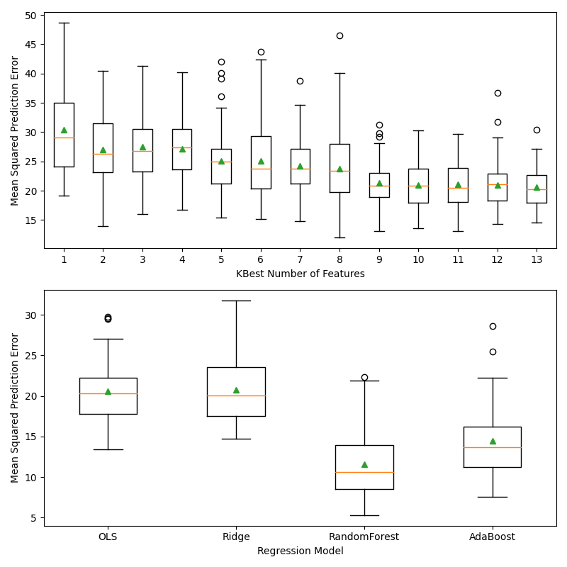

Machine Learning Practice Exercises in Python
=============================================

Objective
---------

Using scikit-learn, illustrate how to use basic concepts and algorithms in machine learning.

List of Exercises
-----------------

1. `ridge_vs_lasso.py <ridge_vs_lasso.py>`_: Fit a high order polynomial to sin function data, using ridge and lasso regulariztion to control the magnitude of the polynomial coefficients.
2. `boston_housing_regression.py <boston_housing_regression.py>`_: Fit boston house price target variable (from sci-kit learn included test data set) using up to 13 predictor variables and several regression models.

Gallery
-------

Ridge vs. Lasso
^^^^^^^^^^^^^^^

Boston Housing Regression
^^^^^^^^^^^^^^^^^^^^^^^^^

Left side: raw predictor variable distributions; right side: distributions after rescaling with yeo-johnson transform.

Top: bias variance tradeoff vs. increasing number of features included in OLS regression model; bottom: prediction vs. observation mean squared error for four regression models, using default hyperparameters.

House price prediction vs. observation of test split based on fit of training data to four regression models.

